# FCND-Term1-P3-3D-Quadrotor-Controller
Udacity Flying Car Nanodegree - Term 1 - Project 3 - 3D Quadrotor Controller

In this project, you get to implement and tune a [cascade PID controller](https://controlstation.com/cascade-control-cascade-control-configured/) for drone trajectory tracking. The theory behind the controller design using feed-forward strategy is explained in details on our instructor, [Angela P. Schoellig](http://www.dynsyslab.org/prof-angela-schoellig/), on her paper [Feed-Forward Parameter Identification for Precise Periodic
Quadrocopter Motions](http://www.dynsyslab.org/wp-content/papercite-data/pdf/schoellig-acc12.pdf). The following diagram could be found on that paper describing the cascaded control loops of the trajectory-following controller:

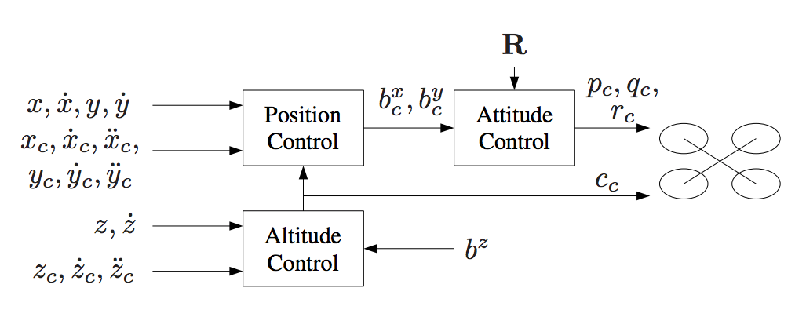

# Project description

There two parts for this project where the controller needs to be implemented with python on the first one, and with c++ in the second one.

## Python implementation

Based on the [first project](https://github.com/darienmt/FCND-Term1-P1-Backyard-Flyer) on the FCND. We need to control a simulated drone using python to fly in a square trajectory in a backyard. The controller needs to be implemented on the [controller.py class](./python/controller.py). Udacity provides a [seed project](https://github.com/udacity/FCND-Controls) all the code you need to be able to focus only on the controller, but changes on that code is welcome as well.  Udacity's FCND Simulator could be downloaded [here](https://github.com/udacity/FCND-Simulator-Releases/releases). The python code use [Udacidrone](https://udacity.github.io/udacidrone/) API to communicate with the simulator. This API use [MAVLink](http://qgroundcontrol.org/mavlink/start) protocol.

### Prerequisites

To run this project, you need to have the following software installed:

- [Miniconda](https://conda.io/miniconda.html) with Python 3.6. I had some problems while installing this on my Mac after having an older version install and some other packages install with Homebrew. I have to manually delete all the `~/*conda*` directory from my home and then install it with `bash Miniconda3-latest-MacOSX-x86_64.sh -b`.
- [Udacity FCND Simulator](https://github.com/udacity/FCND-Simulator-Releases/releases) the latest the better.

### Run the code

Change directory to where you clone this repo and move to the [/python](./python) directory. Let's call that directory **REPO_PYTHON_PATH**. Create the conda environment for this project:
```
conda env create -f environment.yml
```
**Note**: This environment configuration is provided by Udacity at [the FCND Term 1 Starter Kit repo](https://github.com/udacity/FCND-Term1-Starter-Kit).

Activate your environment with the following command:
```
source activate fcnd
```
Start the drone simulator. You will see something similar to the following image:

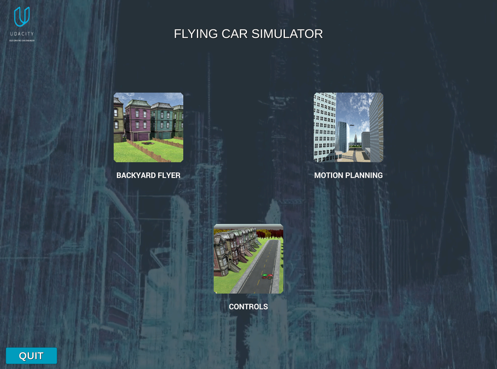

Click on **CONTROLS** item, and you will see the drone on the ground:

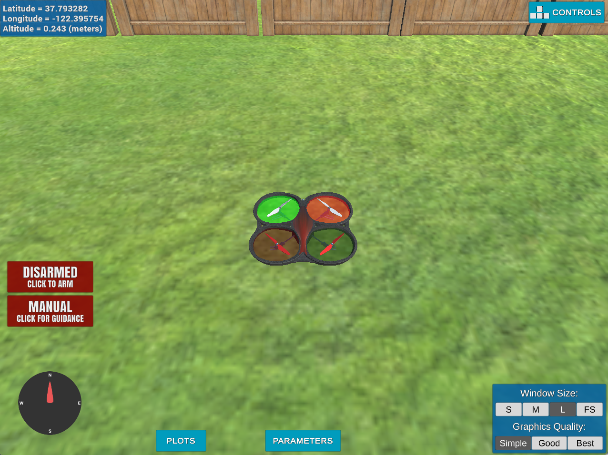

At this point, the simulator is waiting for connections ready to fly the drone. Time to run the controller.

```
python controls_flyer.py
```

The drone will follow the trajectory specified by the file [test_trajectory.txt](./python/test_trajectory.txt). The video of the drone could be found [here](python-simulator.mov):


At the end of the execution, the code evaluates the performance based on the project acceptance criteria. You should see something similar to this:

```
python controls_flyer.py
Logs/TLog.txt
For visual autograder start visdom server: python -m visdom.server
Logs/NavLog.txt
starting connection
arming transition
takeoff transition
landing transition
disarm transition
manual transition
Closing connection ...
Maximum Horizontal Error:  1.6877431474840618
Maximum Vertical Error:  0.6513343825915365
Mission Time:  4.223532
Mission Success:  True
```
The telemetry file for this particular execution is [this file](./python/telemetry/TLog02.txt). To tune the controller is very hard on this trajectory. In the beginning, you don't know what to expect. The trajectory looks something like this:

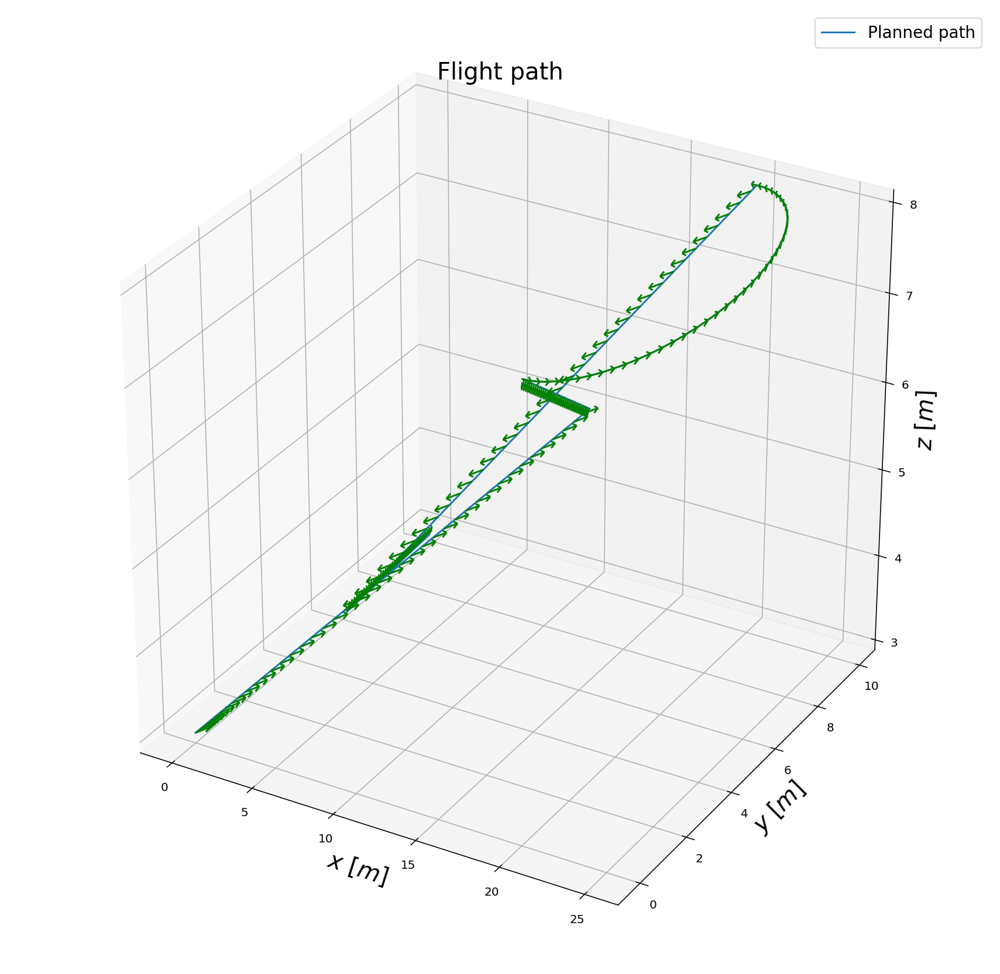

In order to check the implementation and do some tuning of the parameters before testing them on the real trajectory, I generated the following trajectories:

- [go_north_east](./python/trajectories/go_north_east.txt)
- [go_north](./python/trajectories/go_north.txt)
- [stay_there](./python/trajectories/stay_there.txt)

To load one of this trajectories instead of [test_trajectory.txt](./python/test_trajectory.txt), uncomment line 210 on [controls_flyer.py](./python/controls_flyer.py#L210) and set the desired trajectory file there. The generation of the trajectories was done by [Test Trajectory](./visualizations/Test%20Trajectory.ipynb) Jupyter Notebook.

## C++ implementation

This is the more complicated part of the project. If the parameter tuning on the python part was hard, this part is ten times harder. The C++ part is just a detail on this onerous task. In this case, the simulator is enforced more real limits to the implementation, and things can go wrong when some of those limits are not implemented correctly. More interesting than that is when things are not entirely wrong, just a bit. Udacity also provides a [seed project](https://github.com/udacity/FCND-Controls-CPP) with the simulator implementation and placeholders for the controller code. The seed project README.md give guides to run the project and information of the task we need to execute for implementing the controller. There are five scenarios we need to cover. The simulator runs in a loop on the current scenario and show on the standard output an indication the scenario pass or not.

All the C++ code is in the [/cpp](./cpp) directory. The more interesting files are:

- [/cpp/config/QuadControlParams.txt](./cpp/config/QuadControlParams.txt): This file contains the configuration for the controller. While the simulator is running, you can modify this file, and the simulator will "refresh" those parameters on the next loop execution.
- [/cpp/src/QuadControl.cpp](./cpp/src/QuadControl.cpp): This is where all the fun is, but I should not say this because this file contains the implementation of the controller only. Most of the time needed to pass the scenarios is spend on the parameter tuning.

### Prerequisites

Nothing extra needs to install but the IDE is necessary to compile the code. In my case XCode because I am using a Macbook. Please, follow the instructions on the [seed project README.md](https://github.com/udacity/FCND-Controls-CPP).

### Run the code

Following the instruction on the seed project, load the project on the IDE. Remember the code is on [/cpp](./cpp).

#### Scenario 1: Intro

In this scenario, we adjust the mass of the drone in [/cpp/config/QuadControlParams.txt](./cpp/config/QuadControlParams.txt) until it hovers for a bit:

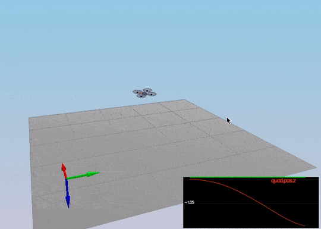

This video is [cpp-scenario-1.mov](./videos/cpp-scenario-1.mov)

When the scenario is passing the test, you should see this line on the standard output:

```
PASS: ABS(Quad.PosFollowErr) was less than 0.500000 for at least 0.800000 seconds
```

#### Scenario 2: Body rate and roll/pitch control

Now is time to start coding. The [GenerateMotorCommands method](./cpp/src/QuadControl.cpp#L58-L93) needs to be coded resolving this equations:

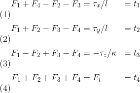

Where all the `F_1` to `F_4` are the motor's thrust, `tao(x,y,z)` are the moments on each direction, `F_t` is the total thrust, kappa is the drag/thrust ratio and `l` is the drone arm length over square root of two. These equations come from the classroom lectures. There are a couple of things to consider. For example, on NED coordinates the `z` axis is inverted that is why the moment on `z` was inverted here. Another observation while implementing this is that `F_3` and `F_4` are switched, e.g. `F_3` in the lectures is `F_4` on the simulator and the same for `F_4`.

The second step is to implement the [BodyRateControl method](./cpp/src/QuadControl.cpp#L95-L121) applying a [P controller](https://en.wikipedia.org/wiki/Proportional_control) and the moments of inertia. At this point, the `kpPQR` parameter has to be tuned to stop the drone from flipping, but first, some thrust needs to be commanded in the altitude control because we don't have thrust commanded on the `GenerateMotorCommands` anymore. A good value is `thurst = mass * CONST_GRAVITY`.

Once this is done, we move on to the [RollPitchControl method](./cpp/src/QuadControl.cpp#L124-L167). For this implementation, you need to apply a few equations. You need to apply a P controller to the elements `R13` and `R23` of the [rotation matrix](https://en.wikipedia.org/wiki/Rotation_matrix) from body-frame accelerations and world frame accelerations:

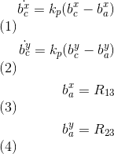

But the problem is you need to output roll and pitch rates; so, there is another equation to apply:

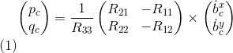

It is important to notice you received thrust and thrust it need to be inverted and converted to acceleration before applying the equations. After the implementation is done, start tuning `kpBank` and `kpPQR`(again? yes, and it is not the last time) until the drone flies more or less stable upward:

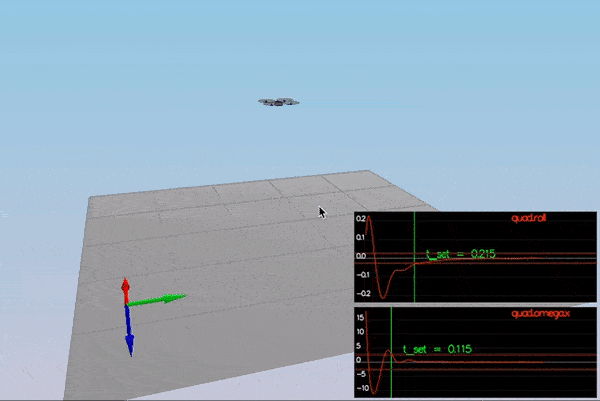

This video is [cpp-scenario-2.mov](./videos/cpp-scenario-2.mov)

When the scenario is passing the test, you should see this line on the standard output:

```
PASS: ABS(Quad.Roll) was less than 0.025000 for at least 0.750000 seconds
PASS: ABS(Quad.Omega.X) was less than 2.500000 for at least 0.750000 seconds
```

#### Scenario 3: Position/velocity and yaw angle control

There are three methods to implement here:

- [AltitudeControl](./cpp/src/QuadControl.cpp#L169-L212): This is a [PD controller](https://en.wikipedia.org/wiki/PID_controller) to control the acceleration meaning the thrust needed to control the altitude.

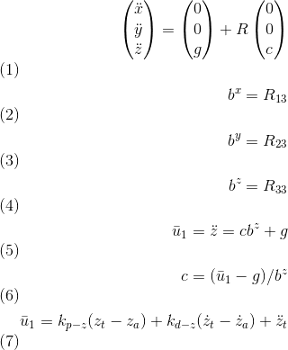

To test this, go back to scenario 2 and make sure the drone doesn't fall. In that scenario, the PID is configured not to act, and the thrust should be `mass * CONST_GRAVITY`.

- [LateralPositionControl](./cpp/src/QuadControl.cpp#L215-L267) This is another PID controller to control acceleration on `x` and `y`.

- [YawControl](./cpp/src/QuadControl.cpp#L270-L302): This is a simpler case because it is P controller. It is better to optimize the yaw to be between `[-pi, pi]`.

Once all the code is implemented, put all the `kpYaw`,`kpPosXY`, `kpVelXY`, `kpPosZ` and `kpVelZ` to zero. Take a deep breath, and start tuning from the altitude controller to the yaw controller. It takes time. Here is a video of the scenario when it passes:

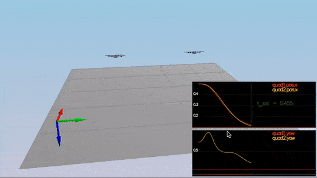

This video is [cpp-scenario-3.mov](./videos/cpp-scenario-3.mov)

When the scenario is passing the test, you should see this line on the standard output:

```
PASS: ABS(Quad1.Pos.X) was less than 0.100000 for at least 1.250000 seconds
PASS: ABS(Quad2.Pos.X) was less than 0.100000 for at least 1.250000 seconds
PASS: ABS(Quad2.Yaw) was less than 0.100000 for at least 1.000000 seconds
```

#### Scenario 4: Non-idealities and robustness

This is a fun scenario. Everything is coded and tuned already, right? Ok, we need to add an integral part to the altitude controller to move it from PD to PID controller. What happens to me here is that everything starts not working correctly, and I have to tune everything again, starting from scenario -1. Remember patience is a "virtue", and to it again. If you cannot and get frustrated talk to your peers, they will be able to give you hints. It is hard but doable:

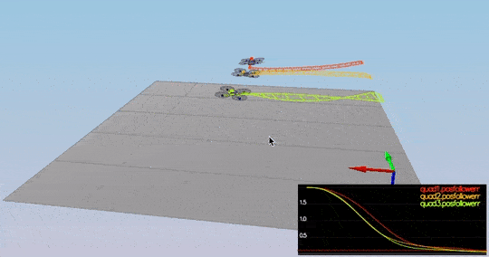

This video is [cpp-scenario-4.mov](./videos/cpp-scenario-4.mov)

When the scenario is passing the test, you should see this line on the standard output:

```
PASS: ABS(Quad1.PosFollowErr) was less than 0.100000 for at least 1.500000 seconds
PASS: ABS(Quad2.PosFollowErr) was less than 0.100000 for at least 1.500000 seconds
PASS: ABS(Quad3.PosFollowErr) was less than 0.100000 for at least 1.500000 seconds
```

#### Scenario 5: Tracking trajectories

This is the final non-optional scenario. The drone needs to follow a trajectory. It will show all the errors in your code and also force you to tune some parameters again. Remember there are comments on the controller methods regarding limits that need to be imposed on the system. Here those limits are required in order to pass.

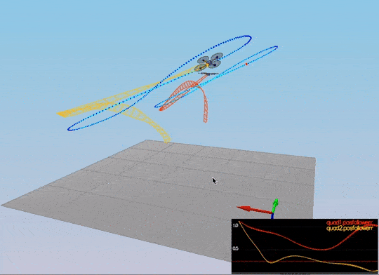

This video is [cpp-scenario-5.mov](./videos/cpp-scenario-5.mov)

When the scenario is passing the test, you should see this line on the standard output:

```
PASS: ABS(Quad2.PosFollowErr) was less than 0.250000 for at least 3.000000 seconds
```

There are a few optional scenarios on this project, but I was exhausted. Too many long hours were tuning parameters and finding bugs. There should be a lot of room for improvement. Here is the video of a multi-drone scenario:

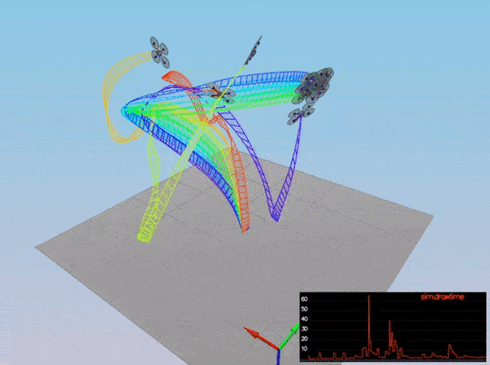

No idea why some of them go nuts!!!!! (and then come back to the "formation".)

# [Project Rubric](https://review.udacity.com/#!/rubrics/1643/view)

## Writeup
### Provide a Writeup / README that includes all the rubric points and how you addressed each one. You can submit your write-up as markdown or pdf.

This markdown is the write-up.

## Implemented Controller

### Implemented body rate control in python and C++.

The body rate control is implemented as proportional control in [/python/controller.py body_rate_control method](./python/controller.py#L201-L222) from line 201 to 222 using Python and in [/cpp/src/QuadControl::BodyRateControl method ](/cpp/src/QuadControl.cpp#L95-L121) from line 95 to 121 using C++.

### Implement roll pitch control in python and C++.

The roll pitch control is implemented in [/python/controller.py roll_pitch_controller method](./python/controller.py#L168-L199) from line 168 to 199 using Python and in [/cpp/src/QuadControl::RollPitchControl method ](/cpp/src/QuadControl.cpp#L124-L167) from line 124 to 167 using C++.

### Implement altitude control in python.

The altitude control is implemented in [/python/controller.py altitude_control method](./python/controller.py#L146-L165) from line 146 to 165 using Python.

### Implement altitude controller in C++.

The altitude control is implemented in [/cpp/src/QuadControl::AltitudeControl method ](/cpp/src/QuadControl.cpp#L169-L212) from line 169 to 212 using C++.

### Implement lateral position control in python and C++.

The lateral position control is implemented in [/python/controller.py lateral_position_control method](./python/controller.py#L93-L124) from line 93 to 124 using Python and in [/cpp/src/QuadControl::LateralPositionControl method ](/cpp/src/QuadControl.cpp#L215-L267) from line 215 to 267 using C++.

### Implement yaw control in python and C++.

The yaw control is implemented in [/python/controller.py yaw_control method](./python/controller.py#L224-L233) from line 224 to 233 using Python and in [/cpp/src/QuadControl::YawControl method ](/cpp/src/QuadControl.cpp#L270-L302) from line 270 to 302 using C++.

### Implement calculating the motor commands given commanded thrust and moments in C++.

The calculation implementation for the motor commands is in [/cpp/src/QuadControl::GenerateMotorCommands method ](/cpp/src/QuadControl.cpp#L58-L93) from line 58 to 93.

## Flight Evaluation

### Your python controller is successfully able to fly the provided test trajectory, meeting the minimum flight performance metrics.

The Python implementation meets the minimum flight performance metrics:

```
Maximum Horizontal Error:  1.6877431474840618
Maximum Vertical Error:  0.6513343825915365
Mission Time:  4.223532
Mission Success:  True
```

Telemetry files are provided on the [/python/telemetry](./python/telemetry) directory.

### Your C++ controller is successfully able to fly the provided test trajectory and visually passes the inspection of the scenarios leading up to the test trajectory.

The implementation pass scenarios 1 - 5 on the C++ simulator:

```
# Scenario 1
PASS: ABS(Quad.PosFollowErr) was less than 0.500000 for at least 0.800000 seconds
# Scenario 2
PASS: ABS(Quad.Roll) was less than 0.025000 for at least 0.750000 seconds
PASS: ABS(Quad.Omega.X) was less than 2.500000 for at least 0.750000 seconds
# Scenario 3
PASS: ABS(Quad1.Pos.X) was less than 0.100000 for at least 1.250000 seconds
PASS: ABS(Quad2.Pos.X) was less than 0.100000 for at least 1.250000 seconds
PASS: ABS(Quad2.Yaw) was less than 0.100000 for at least 1.000000 seconds
# Scenario 4
PASS: ABS(Quad1.PosFollowErr) was less than 0.100000 for at least 1.500000 seconds
PASS: ABS(Quad2.PosFollowErr) was less than 0.100000 for at least 1.500000 seconds
PASS: ABS(Quad3.PosFollowErr) was less than 0.100000 for at least 1.500000 seconds
# Scenario 5
PASS: ABS(Quad2.PosFollowErr) was less than 0.250000 for at least 3.000000 seconds
```
